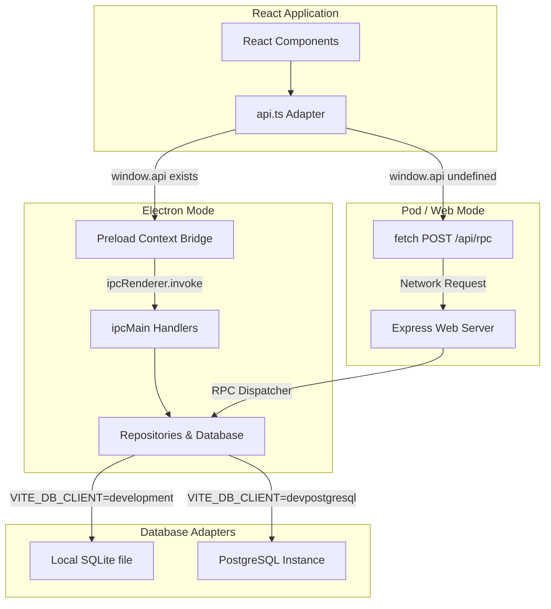

# Kampaignz Tabletop Campaign Manager

Kampaignz is a premium Tabletop Campaign Builder and Manager designed to assist Game Masters (GMs) and Dungeon Masters (DMs) in planning, tracking, and chronicling campaigns with style.

---

## 🏗️ Symmetrical Hybrid Architecture

Kampaignz is built using a unique **Symmetrical Hybrid Architecture** designed to execute seamlessly in two entirely different contexts without changing a single line of React UI code:

1. **Native Desktop Mode (Electron)**: A local, offline-first application saving to a local SQLite file database.
2. **Standalone Web Mode (Pod/Web Server)**: A containerized or self-hosted web application serving multiple users using either local SQLite or a shared PostgreSQL database cluster.

### Communication Flow Diagram

The Frontend API layer dynamically wraps both IPC (for desktop Electron) and RPC-over-HTTP (for web browser clients) seamlessly:



---

## 🛠️ Getting Started

### Prerequisites

Ensure you have Node.js and npm installed. Sourcing your NVM profile may be required:
```bash
source ~/.nvm/nvm.sh
```

---

## 🚀 Running the Application

### 1. Desktop Mode (Electron)
Launch Kampaignz as a local Electron desktop application:
```bash
npm run start:fe
```
*Note:* SQLite migrations are run automatically on application startup.

### 2. Standalone Web Mode (Pod/Web Server)
Run Symmetrical Kampaignz Node.js web-server and API in development mode with watch/hot-reloading enabled:
```bash
npm run dev
```

---

## 🧪 Testing

Kampaignz uses **Vitest** for running fast repository, database mapping, and IPC integration tests.
```bash
npm run test
```

With coverage report:
```bash
npm run test:coverage
```

## Lint

```bash
npm run lint
```