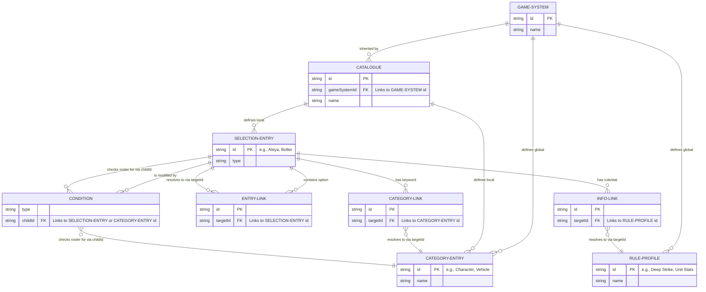

# BattleScribe Data Schema: Linking Mechanisms

The Warhammer 40,000 game system (`.gst`) and faction catalogue (`.cat`) files are structured using the BattleScribe XML schema. In this architecture, data is heavily relational, meaning entries are defined once and referenced globally. 

Here is how the core linking attributes (`id`, `targetId`, and `childId`) establish relationships between these files.

## Core Linking Attributes

1. **`id` (The Primary Key)**
   Every significant element in the data (like a `<categoryEntry>`, `<selectionEntry>`, `<profile>`, or `<rule>`) is assigned a unique `id`. This acts as the source of truth for that entity.
   - *Example*: In the `.gst`, the `Character` category is defined as `<categoryEntry id="9cfd-1c32-585f-7d5c" name="Character" />`.

2. **`targetId` (The Foreign Key / Pointer)**
   Instead of duplicating data, the schema uses "Link" elements (like `<categoryLink>`, `<entryLink>`, `<infoLink>`). These links use `targetId` to point to the `id` of the actual element they are referencing.
   - *Example*: In the `.cat`, the "Aleya" selection entry has a `<categoryLink targetId="9cfd-1c32-585f-7d5c" />`. This tells the system that Aleya has the "Character" keyword defined in the core `.gst` file.

3. **`childId` (The Condition Checker)**
   When creating conditional logic (like constraints or modifiers), the system needs to evaluate if certain elements exist in your army roster. The `<condition>` tags use `childId` to specify the `id` of the item they are looking for.
   - *Example*: A modifier might state "Add 1 to Attack if the roster contains the weapon". The condition would use `childId="[weapon_id]"` to evaluate the roster.

## System to Catalogue Inheritance

The very first link established is between the Catalogue and the Game System. The `.cat` file specifies a `gameSystemId` in its root `<catalogue>` tag. This allows the catalogue to inherit all the core rules, cost types, profile types, and categories defined in the `.gst` file.

```xml
<!-- In Imperium - Adeptus Custodes.cat -->
<catalogue gameSystemId="sys-352e-adc2-7639-d6a9" ...>
```
*The `gameSystemId` matches the `<gameSystem id="sys-352e-adc2-7639-d6a9">` found in the `.gst`.*

---

## Schema Diagram

The following Entity-Relationship (ER) diagram visualizes how definitions and links interact across the system and catalogue files.



### Walkthrough of a Link (Example: Aleya)

1. The `.cat` file defines a `<selectionEntry>` for the model **Aleya** (`id="9e42-7207-9c30-6122"`).
2. Inside Aleya, there is an `<infoLink targetId="7cb5-dd6b-dd87-ad3b" name="Deep Strike" />`.
3. The parser searches for `id="7cb5-dd6b-dd87-ad3b"` to pull the rules for Deep Strike. It will check the local catalogue first, and then the inherited game system.
4. Inside Aleya, there is also a `<categoryLink targetId="9cfd-1c32-585f-7d5c" name="Character" />`.
5. The parser matches `targetId="9cfd-1c32-585f-7d5c"` with the `id` of the "Character" `<categoryEntry>` located in the `.gst` file.
