# Crusade Entity Map

The `Crusade` entity is defined as a shared `<selectionEntryGroup>` in the `Imperium - Adeptus Custodes.cat` file. It acts as a container for all the narrative and campaign mechanics tied to a unit in a Crusade roster.

The following graph visualizes the structure of the `Crusade` group, distinguishing between items that are locally defined within the group and items that are linked (via `entryLink`) to global definitions in the `.gst` or elsewhere in the catalogue.

```mermaid
graph TD
    classDef main fill:#2c3e50,stroke:#34495e,stroke-width:2px,color:#ecf0f1
    classDef group fill:#2980b9,stroke:#2980b9,stroke-width:1px,color:#ffffff
    classDef entry fill:#27ae60,stroke:#2ecc71,stroke-width:1px,color:#ffffff
    classDef link fill:#e67e22,stroke:#d35400,stroke-width:1px,color:#ffffff
    classDef profile fill:#8e44ad,stroke:#9b59b6,stroke-width:1px,color:#ffffff

    %% Main Root
    Crusade["<b>selectionEntryGroup: Crusade</b><br/>(id: dffe-91f2-f156-0566)"]:::main

    %% Direct Links
    Exp["<b>entryLink: Experience Points</b><br/>(targetId: 2dbf...)"]:::link
    LegVet["<b>entryLink: Legendary Veterans</b><br/>(targetId: 1511...)"]:::link
    BatScars["<b>entryLink: Battle Scars</b><br/>(targetId: 1576...)"]:::link
    CodexScars["<b>entryLink: Codex Battle Scars</b><br/>(targetId: a934...)"]:::link

    %% Local Entries
    EarnName["<b>selectionEntry: Earning of A Name</b><br/>(upgrade)"]:::entry
    Profile["<b>profile: Earned Name</b><br/>(Abilities)"]:::profile

    %% Subgroups
    Tallies["<b>selectionEntryGroup: Battle Tallies</b>"]:::group
    T_Play["<b>selectionEntry: Battles Played</b>"]:::entry
    T_Surv["<b>selectionEntry: Battles Survived</b>"]:::entry
    T_Kill["<b>selectionEntry: Enemy Units Destroyed</b>"]:::entry

    Honours["<b>selectionEntryGroup: Battle Honours</b>"]:::group
    WMod["<b>selectionEntryGroup: Weapon Modifications</b>"]:::group
    
    %% Nested Links in Battle Honours
    WModLink["<b>entryLink: Weapon Modifications</b><br/>(targetId: d1a5...)"]:::link
    BatTraits["<b>entryLink: Battle Traits</b><br/>(targetId: 0511...)"]:::link
    CodexTraits["<b>entryLink: Codex Battle Traits</b>"]:::link
    
    Relics["<b>entryLink: Crusade Relics</b><br/>(targetId: e919...)"]:::link
    CodexRelics["<b>entryLink: Codex Crusade Relics</b>"]:::link
    Vaults["<b>entryLink: Artefacts of the Vaults</b>"]:::link
    
    Tyrannic["<b>entryLink: Tyrannic War Battle Honours</b>"]:::link
    Pariah["<b>entryLink: Pariah Nexus Blackstone...</b>"]:::link

    %% Relationships
    Crusade --> Exp
    Crusade --> LegVet
    Crusade --> BatScars
    BatScars --> CodexScars
    
    Crusade --> EarnName
    EarnName --> Profile

    Crusade --> Tallies
    Tallies --> T_Play
    Tallies --> T_Surv
    Tallies --> T_Kill

    Crusade --> Honours
    Honours --> WMod
    WMod --> WModLink
    
    Honours --> BatTraits
    BatTraits --> CodexTraits
    
    Honours --> Relics
    Relics --> CodexRelics
    Relics --> Vaults
    
    Honours --> Tyrannic
    Honours --> Pariah
```

### Breakdown of Entities

1. **Direct Entry Links (`<entryLink>`)**:
   - Items like **Experience Points**, **Legendary Veterans**, and the root **Battle Scars** group are not fully defined here. The `Crusade` group just contains pointers (`targetId`) that tell the system to import these choices. These are typically global Crusade rules defined in the `.gst`.

2. **Battle Tallies (`<selectionEntryGroup>`)**:
   - Contains simple toggles (`<selectionEntry>`) to track "Battles Played", "Battles Survived", and "Enemy Units Destroyed".

3. **Battle Honours (`<selectionEntryGroup>`)**:
   - Contains a mix of nested groups (like **Weapon Modifications**) and links to broader upgrade tables.
   - For example, it links to the generic **Battle Traits** table, which in turn links to the **Codex Battle Traits** specific to the faction.

4. **Earning of a Name (`<selectionEntry>`)**:
   - This is an upgrade unique to Custodes. It contains a `<profile>` defining the rule ("Each time this model's unit is selected to fight...").
